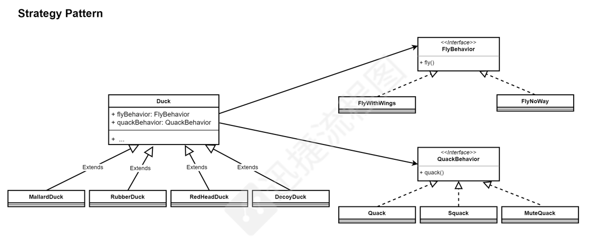
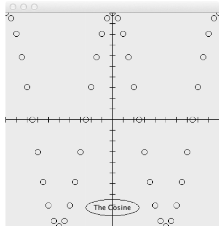
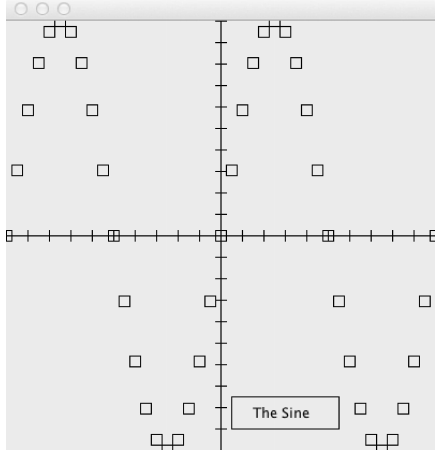

# OOAD 问题与解答

## 设计模式

### 问题1

> 启发许多设计模式的一个原则可以被称为“多用组合，少用继承”

#### 1-a

> 说明属于继承和组合的意思，给出一个简短的代码示例来进行解释

继承是指类 A从类 B 派生而来，它继承了类 A 相关的字段和方法，可以添加一些新的特定特性

```java
public class Shape{
    protected Color color;
    protected int size;
}
public class Circle extends Shape{
    private int radius;
}
```

组合是指类 A 的某些字段/属性包含类 B，它使用类 B 完成一些操作，或者将类 B 当作它的一个部分

```java
public class Animal{
    private Fly fly;
    private Quack quack;
    
    public performFly(){
        fly.active();
    }
    public performQuack(){
        quack.active();
    }
}
```

#### 1-b

> 给出两个原因，为什么你认为“多用组合，少用继承”是个好的想法。确保你给出的理由是合理的，在必要的时候使用一些简单的代码示例

1. 子类可能继承了一些父类没有用的方法或属性，这会造成很多代码上的冗余，而组合可以使用不同的类的功能来进行组装，产生新的方法
2. 继承的子类在编译的时候就需要确定下来，而组合可以在动态的运行期间才确定使用的方法（策略模式）

#### 1-c

> 给出一个设计模式的例子，该模式使用组合在运行时扩展对象的功能

策略模式

#### 1-d

> 对 1-c 中你讲的策略模式进行简要的总结描述

策略模式是一种包装算法的方式，当类中出现了有多个算法接口，并且可以提供不同的实现时候。我们将这些算法族封装成类，通过组合的方式，可以实现动态的调用、替换算法。并且更换更好的实现逻辑和版本等

#### 1-e

> 画一个简单的类图，描述在 1-c 中确定模式的类图



#### 1-f

> 讨论一个例子，说明如何在实践中使用 1-c 中的模式。你可以从作业中的经验，我们在课堂上讨论过的例子，或者 Java 标准库本身中得出这个例子

在课堂中，我们说鸭子类的飞行行为和喊叫行为因为鸭子的不同而有非常多的情况，有的可以飞，有的可以叫，所以我们要将这些行为封装成接口，由具体的实现类实现这些接口。而鸭子类中拥有拥有这些接口，它们可以被动态的装配，以展示鸭子不同的行为。

## 重构

### 问题1

> Recently a mathematician friend asked me to write an application which displayed the sine and cosine functions as graphs. As part of that application, I developed two classes which extend the JPanel class to plot one or other of these functions. My rather scrappy code for these classes is displayed on this page and the next: 

```java
public class SinePlotter extends Jpanel{
    /*
    	Defalut constructor. Initialises the size of this panel
    */
    SinePlotter(){
        setPreferredSize(new Dimension(400, 400));
    }
    
    protected void paintCompoment(Graphics pGraphics){
        // draw the x-axis
        pGraphics.drawLine(0, 200, 400, 200);
        for(int i = 0; i <= 400; i+=20){
            pGraphics.drawLine(i, 200-5, i, 200+5);
        }
        // draw the y-axis
        pGraphics.drawLine(200, 0, 200, 400);
        for(int j = 0; j <= 400; j+=20){
            pGraphics.drawLine(200-5, j, 200+5, j);
        }
        
        // plot the graph itself
        ...
        
        // plot the legend
        pGraphics.drawRect(210, 350, 100, 30);
        pGraphics.drawString("The_Sine", 230, 370);
    }
}

public class CosinePlotter extends Jpanel{
    /*
    	Defalut constructor. Initialises the size of this panel
    */
    CosinePlotter(){
        setPreferredSize(new Dimension(400, 400));
    }
    
    protected void paintCompoment(Graphics pGraphics){
        // draw the x-axis
        pGraphics.drawLine(0, 200, 400, 200);
        for(int i = 0; i <= 400; i+=20){
            pGraphics.drawLine(i, 200-5, i, 200+5);
        }
        // draw the y-axis
        pGraphics.drawLine(200, 0, 200, 400);
        for(int j = 0; j <= 400; j+=20){
            pGraphics.drawLine(200-5, j, 200+5, j);
        }
        
        // plot the graph itself
        ...
            
        // plot the legend
        pGraphics.drawRect(210, 350, 100, 30);
        pGraphics.drawString("The_Sine", 230, 370);
    }
}
```

> When objects of these classes are used as the content pane of a main JFrame window, they give rise to the following application displays: 

	

> Take a few minutes to understand what this code is doing, and then answer the following questions:
>
> a. Briefly explain what the terms code refactoring and code smell mean.
>
> b. Identify three (3) code smells which occur in the code displayed on the code. For each of the code smells you have written down explain exactly how it is manifested in my code.
>
> c. Refactor the code to avoid the code smells you identified in part (b) above. In your workbook you should write your refactored code using Java which is as close as you can make it to being correct

#### 1-a

code refactoring

- Semantic-preserving program transformations
  保留语义的程序转换
- change the code's internal structure without modifying it's function or behavior

code smell

- some code structures that seem bad of maintain and update
- 一种代码变坏的征兆

#### 1-b

1. Duplicated Code

   ```java
   		// draw the x-axis
           pGraphics.drawLine(0, 200, 400, 200);
           for(int i = 0; i <= 400; i+=20){
               pGraphics.drawLine(i, 200-5, i, 200+5);
           }
           // draw the y-axis
           pGraphics.drawLine(200, 0, 200, 400);
           for(int j = 0; j <= 400; j+=20){
               pGraphics.drawLine(200-5, j, 200+5, j);
           }
   ```

2. Long Method

   ```java
       protected void paintCompoment(Graphics pGraphics){
           // draw the x-axis
           pGraphics.drawLine(0, 200, 400, 200);
           for(int i = 0; i <= 400; i+=20){
               pGraphics.drawLine(i, 200-5, i, 200+5);
           }
           // draw the y-axis
           pGraphics.drawLine(200, 0, 200, 400);
           for(int j = 0; j <= 400; j+=20){
               pGraphics.drawLine(200-5, j, 200+5, j);
           }
           
           // plot the graph itself
           ...
           
           // plot the legend
           pGraphics.drawRect(210, 350, 100, 30);
           pGraphics.drawString("The_Sine", 230, 370);
       }
   ```

3. Refused Bequest

   ```java
   public class SinePlotter extends Jpanel
   ```

#### 1-c

```java
public class Plotter extends Jpanel{
    
    private Curve curve;
    
    Plotter(Curve curve){
        setPreferredSize(new Dimension(400, 400));
        this.curve = curve;
    }
    
    private void paintPlot(Graphics pGraphics){
        paintAxis();
        paintCurve();
        paintLegend();
    }
    
    private void paintAxis(Graphics pGraphics){
        // draw the x-axis
        pGraphics.drawLine(0, 200, 400, 200);
        for(int i = 0; i <= 400; i+=20){
            pGraphics.drawLine(i, 200-5, i, 200+5);
        }
        // draw the y-axis
        pGraphics.drawLine(200, 0, 200, 400);
        for(int j = 0; j <= 400; j+=20){
            pGraphics.drawLine(200-5, j, 200+5, j);
        }
    }
    
    private void paintLegend(Graphics pGraphics){
        // plot the legend
        pGraphics.drawRect(210, 350, 100, 30);
        pGraphics.drawString("The_Sine", 230, 370);
    }
    
    private void paintCurve(Graphics pGraphics){
        curve.paint(pGraphics);
    }
}

public interface Curve{
    paintCurve(Graphics pGraphics);
}
public class SineCurve implements Curve(){
    @Override
    public void paintCurve(Graphics pGraphics){
        ...
    }
}

public class CosineCurve implements Curve(){
    @Override
    public void paintCurve(Graphics pGraphics){
        ...
    }
}
```

