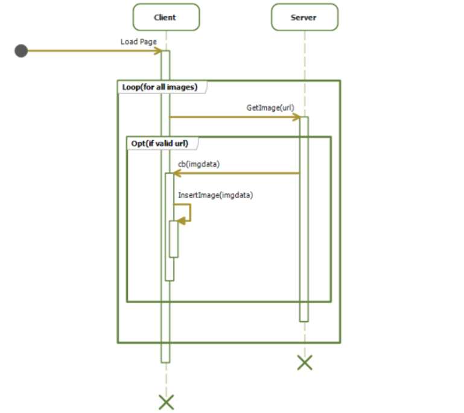
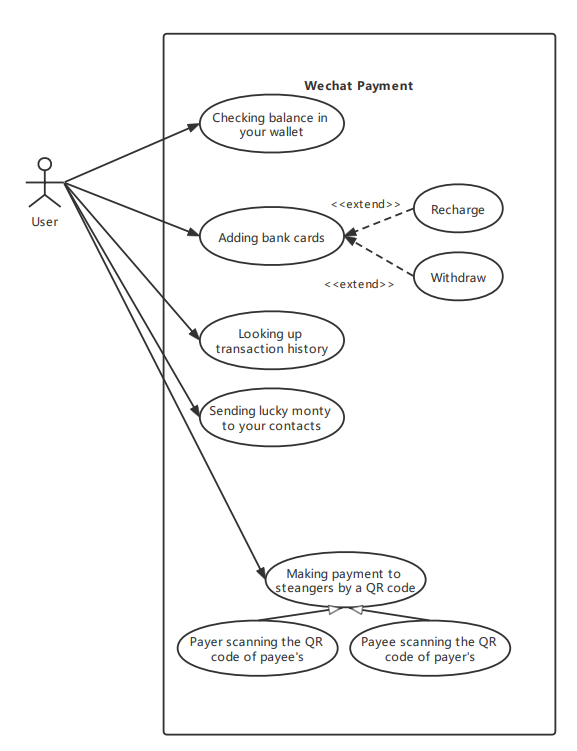
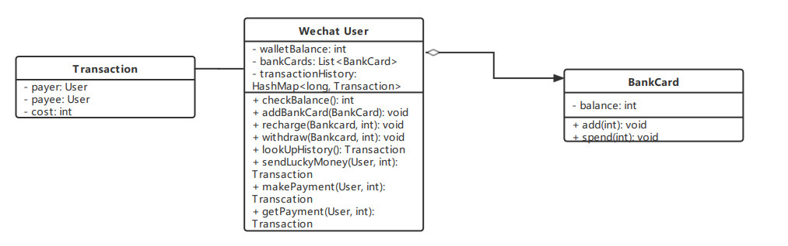
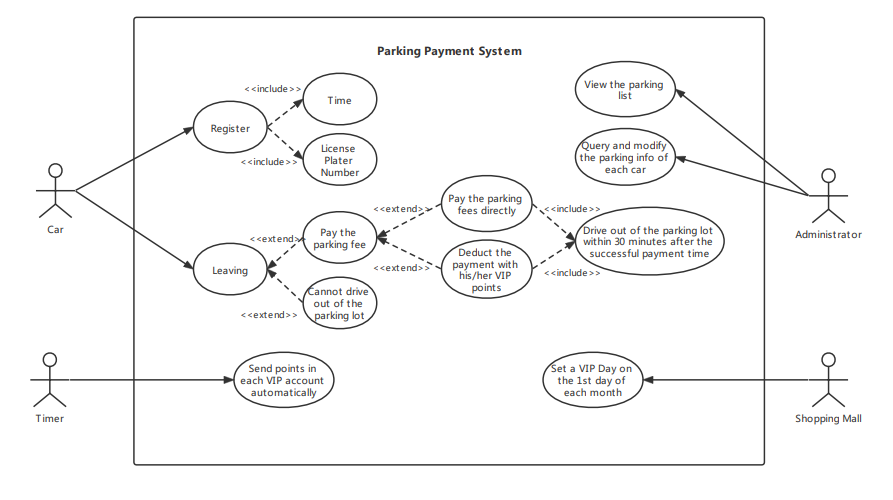
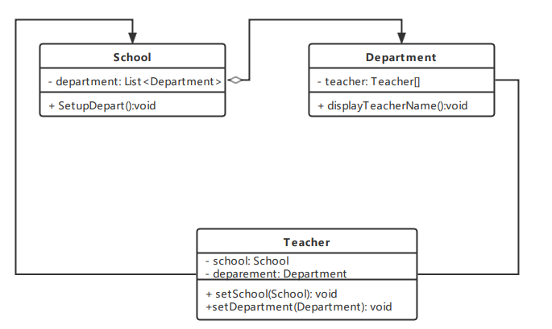
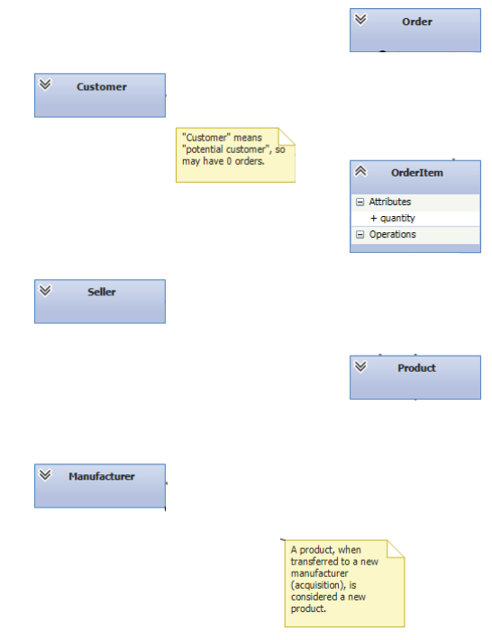
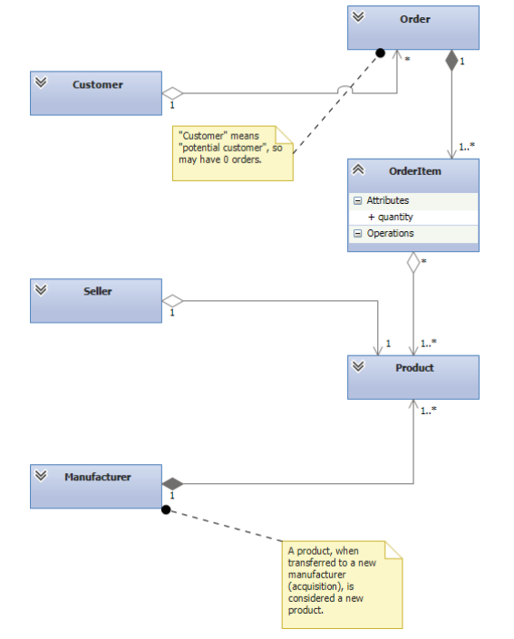
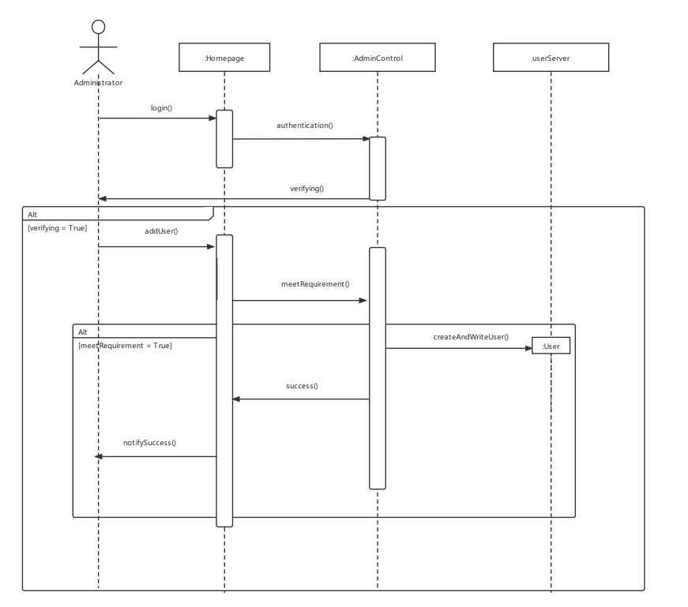

# OOAD Review Questions

## 1. UML

### Filling In Blanks

> What are two aspects of a software system that are explicitly omitted from a UML class diagram?

- timing / ordering of calls; in fact, all dynamic information. More generally, information that appears in other UML diagrams such as sequence diagrams
- Implementation details such as algorithms, data structures, and the actual code.
- Implementation language.

> Describe the two most important differences between composition and aggregation. The answers give details or consequences of the fact that the composite “owns” its elements whereas the aggregate does not

- If a composite is destroyed, so are its elements; but if an aggregate is destroyed, then its elements live on
- In aggregation, but not composition, the aggregated (“contained”) item can be shared by many aggregators
- Composition requires at least one element object (the whole cannot exist without the parts), whereas aggregation requires ≥ 0 elements

### True/False

Consider the following sequence diagram:

	

- The arrow from client to server models a call that blocks and then returns. (F)
  - Async, so does not block and thus does not return. Calls a callback instead.
- The arrow from server to client models a call that blocks and then returns. (F)
  - The call from server to client is an asynchronous callback.
- The arrow from client to client models a call that blocks and then returns. (T)
  - This is a synchronous call.

Is each of the following sequences a possible complete history of calls, immediately after Load Page? Calls to InsertImage are not modeled. Assume that the client and server are both infinitely multithreaded and that execution completes normally (without error).

- No calls. (T)
- GetImage, GetImage, GetImage (T)
- GetImage, cb, GetImage, cb, cb (F)
- GetImage, GetImage, cb, cb, GetImage (T)
- cb, GetImage, cb (F)
- GetImage, GetImage, GetImage, cb, cb, cb (T)

### Multiple Choice

What is the expected relationship between coupling and cohesion?  

- ==A==. As coupling increases, cohesion decreases.  
- B. As coupling increases, so does cohesion.
- C. Making the classes within a package more tightly coupled increases the packages cohesion.
- D. Only classes have cohesion, and only packages' have coupling.
- E. None of the above. Coupling and cohesion are independent. 

Which of the following is true of coupling?

- A. Less coupling is generally better.
- B. Java class C is coupled to class D if C invokes operations of D.
- C. Java class C is coupled to class D if C inherits from D.
- D. Coupling is a measure of how strongly one element is connected to others, has  knowledge of others, and/or relies on others.
- ==E==. All of the above. 

### WeChat Payment

Mobile payment is very popular in China. Many people use WeChat as their third-party payment platform. The following description is a simple design of its payment function. 

You can do multiple operations in WeChat pay, including checking how much balance you have in your wallet, adding bank cards to recharge or withdraw, looking up transaction history, sending lucky money to your contacts, and making payment to strangers by a QR code. In last case, we have two ways of transaction, either the payer scanning the QR code of payee’s or the payee scanning the QR code of payer’s. In addition, user also can change his nickname, password or other information.

**Question: Draw an use case diagram according to the above scenario**

	

**Question 2: Class diagram: Finding out entity class according to your design, and given the class diagram. In this section, you can only provide the class name, necessary attributes, and the indicate the relationship between those classes.**



### Parting

In ShenZhen city, a automatic parking payment system is widely used by almost all shopping malls. Then, it is a time for you to help a newly opened shopping mall design the system. The following description is a simple requirement of the parking management: 

Before a car enter the parking lot, there is an automatic scanning device that can register the time and the license plate number of the car. Before leaving, the customer has to pay the parking fee, otherwise he/she cannot drive out of the parking lot. When paying, the customer can pay the parking fees directly, or he/she can choice to deduct the payment with his/her VIP points if he/she is the VIP of this shopping mall. Customers need to drive out of the parking lot within 30 minutes after the successful payment time, otherwise, the cost will be recalculated. There are several administrators who can view the parking list, and they can also query and modify the parking info of each car. On the other hand, in order to promote sales, the shopping mall set a VIP Day on the 1st day of each month. On the 12:00 am in each VIP Day, the system could send points in each VIP account automatically. 

**Question: Draw an use case diagram according to the above scenario**



### Class Diagram Exercise

According to the code framework below, please design the corresponding class diagram:

```java
public class School {
	private List<Department>departments;
	public void SetUpDepart(){
		departments.add(new Department());
	}
}
public class Department{
	private Teacher[] teacher;
	public void displayTeacherName(){
	}
}
public class Teacher{
	private School school;
	private Department deparment;
	public void setSchool(School school){
		this.school=school;
	}
	public void setDepartment(Department department){
		this.deparment=department;
	}
}
```



---

> Draw the five most significant associations/dependencies (but no type relationships such as subtyping) between the classes shown. Do not add any new classes, and do not model anything other than associations. Add all multiplicities. You may add several words of description to a connector or a multiplicity if you feel it’s necessary, but most full-credit solutions will not need any such description.

	`


### Sequence Diagram Exercise

Translate the following English statements into a representative sequence diagram. The process of adding a user: 

Before using the system, the `administrator` requires to fill in the login information in `home page` . After submitting the login information, the `home page` sends the information to the `administrator control unit` for authentication. After verifying, the `administrator` can add user from system home page . When adding user into server, the system needs to determine whether we filled is to meet the writing requirements in `home page` , and the user can be created and written into `user server` after satisfying this condition. After finishing all the operation, the system will return a successful message in `home page` to tell the user the process is successful. 

In the process there are 4 classes or actor: `Administrator` , `Homepage` , `AdminControl` , `userServer`



## 2. Design Pattern

### Filling in Blanks

> To implement the singleton pattern often (but not always) requires using what other pattern?

- factory pattern

Give two disadvantages of the direct instantiation model that can be solved by using the factory method or factory class patterns.

> Consider the direct instantiation new Date().

- (a) It creates a new thing, whereas you might want an existing one. 
- (b) It creates an object of a specified class (Date), whereas you might want a subclass.

> You are designing a real-time notifications platform for the new social network Google+. One  of the uses will be to support a feature where if one user comments on a photo while another  is viewing, that comment appears “immediately” in the viewing user’s browser. However, you  expect the new social network will acquire many features requiring this framework over the  next year.

- Which design pattern would you utilize when designing this platform at a high level?
  - The Observer pattern
- What is a potential problem you might face if you were to open up this platform to  third-party developers?
  - A significant issue to consider with the Observer pattern is the possibility of changing the  message format/interface used to notify consumers of events. If third-party developers  start developing their applications to use V1 of the notifications platform, and for some  reason you have to change the format, all of these applications will break. Thus you will  need to version your platform so that existing applications don’t break, while still  providing a way for you to innovate your platform for use by new clients created by  third-party developers.

### True/False

- In an implementation of the singleton pattern, there is no constructor. (F)
  - There is a constructor, but it is private

### Multiple choice

Circle all of the following that suggest a composition relationship and not aggregation (do not circle any that suggest both).

- (a) A “parent” element contains or owns zero or more “child” elements
- ==(b)== A strong life cycle dependency
- (c) Shared possession
- (d) At least one class in the relationship depends on the other (in the UML sense of dependency). 
- (e) Both classes in the relationship depend on the other (in the UML sense of dependency).

## 3. Refactoring

### True/False

- An example of refactoring is adding new features to satisfy a customer requirement discovered after a project is shipped.(F)
- Refactoring is a risk: it incurs a cost now, in return for potential payoff later. (T)
- For every refactoring that can improve the design of a software system, undoing or reversing the refactoring can also improve the design of the same system. (T)
- A refactoring is generally motivated by some specific task it will make easier, as opposed to simply improving the code. (T)

