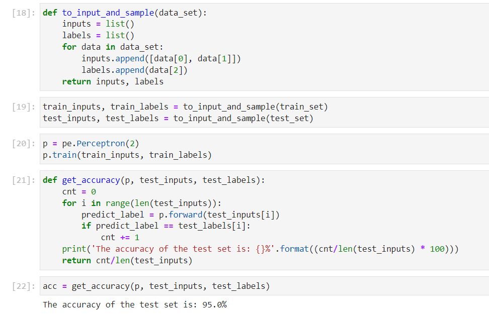
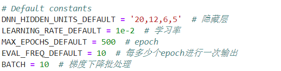
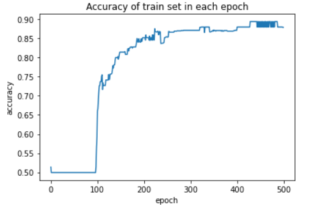
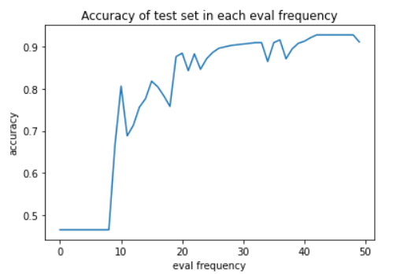
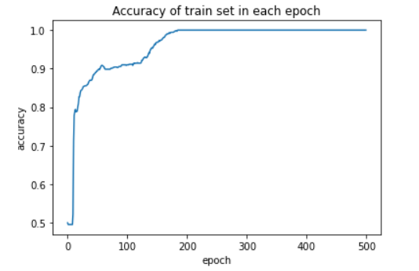
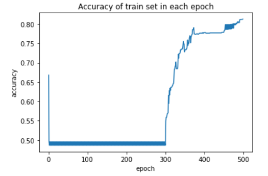
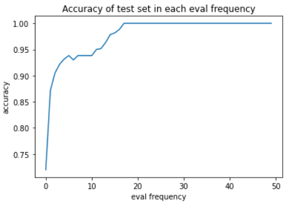
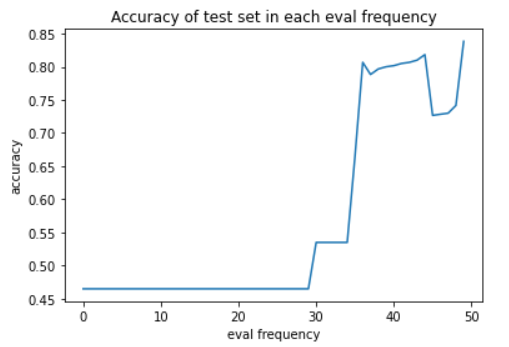

# MLP Report

> 11911839 聂雨荷

## 1. Part I

### 1.1 Task 1

This is two Gaussian distributions and sample 200 points from each

	

### 1.2 Task2

I have implemented the [perceptron.py](./perceptron.py).

### 1.3 Task3

Given the random seed = 42, the classification accuracy on the test set is ==95%==



### 1.4 Task4

If the means of the two Gaussians are too close, the accuracy become worse.

	

If the variances of the two Gaussians are too high, the accuracy become better

	

## 2. Part II

### 2.1 Task1

I have implemented the [mlp_numpy.py](./mlp_numpy.py) and the [modules.py](modules.py).

### 2.2 Task2

I have implemented the [train_mlp_numpy.py](./train_mlp_numpy.py).

### 2.3 Task3

The default parameters are listed below:

	

The accuracy of training data and test data are shown as the figures below:

| training data                                                | test data                                                    |
| ------------------------------------------------------------ | ------------------------------------------------------------ |
|  |  |

## 3. Part III

### 3.1 Task1

I have modified the train method in [train_mlp_numpy.py](./train_mlp_numpy.py).

I used the ==mini-batch== method to compute gradient descent. You can specified certain batch number and  get the result. (The execute method is shown in the last section of the report)

### 3.2 Task2

|                | stochastic gradient descent                                  | batch gradient descent(batch = 30)                           |
| -------------- | ------------------------------------------------------------ | ------------------------------------------------------------ |
| **train data** |  |  |
| **test data**  |  |  |

## 4. How to execute file

### 4.1 Jupyter notebook

#### Import files

In order to successfully execute all the file, you need to import several packages

```python
import numpy as np
import random
from scipy import stats
from sklearn.model_selection import train_test_split
import matplotlib.pyplot as plt
from pandas.core.frame import DataFrame
from sklearn import datasets
```

And two self-defined files.

```python
import perceptron as pe
import train_mlp_numpy
```

#### Execute Code

Please follow the code written in the [Assignment1.ipynb](./Assignment1.ipynb) to see the execution result.

#### MLP problem

For Task2-3, if you use jupyter notebook, after importing previous package. You can use the following code to define your own MLP network and see the execution result.

An example is shown below:

```python
train_mlp_numpy.main(n_hidden='20,12,6,5', lr=1e-2, epoch=500, eval_freq=10, batch=30)
```

- `n_hidden`：the architecture of hidden layers
- `lr`：learning rate
- `epoch`：training epoch
- `eval_freq`：eval frequency in calculate the accuracy in the test data
- `batch`：batch number used in mini-batch gradient descent

If you don't specified certain variable, it will directly use the default parameters.

### 4.2 Command Line

#### MLP problem

You can use the following command. Make sure you are in the same directory hierarchy with [train_mlp_numpy.py](./train_mlp_numpy.py).

```cmake
python train_mlp_numpy.py --dnn_hidden_units 20,12,6,5 --learning_rate 0.01 --max_steps 500 --eval_freq 10 -- batch 30
```

