# Assignment2

> 11911839 聂雨荷

## 1. Part I

### 1.1 Task 1

I have implemented MLP by using pytorch

- [pytorch_mlp.py](./pytorch_mlp.py)
  - define the module of MLP
- [pytorch_train_mlp.py](./pytorch_train_mlp.py)
  - train MLP

And the MLP implemented by myself

- [mlp_numpy.py](./mlp_numpy.py)
  - define the module of MLP
- [train_mlp_numpy.py](./train_mlp_numpy.py)
  - train MLP

### 1.2 Task  2

I use the same dataset (make_moons) in training two MLPs, with the same parameters

- train dataset: 1400
- test dataset: 700
- hidden units: 20, 12, 6, 5
- learning rate: 0.01
- epoch: 500
- eval frequency: 10
- batch: 10
- random seed: 42

The result of two MLPs are as follow:

The architecture of the Pytorch MLP is defined as follow:

```python
class MLP(nn.Module):

    def __init__(self, n_inputs, n_hidden, n_classes):
        super(MLP, self).__init__()
        dims = [n_inputs]
        dims.extend(n_hidden)
        self.layers = list()
        # hidden layer
        for i in range(len(dims) - 1):
            layer = nn.Linear(dims[i], dims[i + 1])
            self.layers.append(layer)
        # output layer
        layer = nn.Linear(dims[-1], n_classes)
        self.fcn = layer

    def forward(self, x):
        for fc in self.layers:
            x = nn.functional.relu(fc(x))
        out = nn.functional.softmax(self.fcn(x), dim=1)
        return out
```

|                        | Train Set                                                    | Test Set                                                     |
| ---------------------- | ------------------------------------------------------------ | ------------------------------------------------------------ |
| implemented by myself  |  | 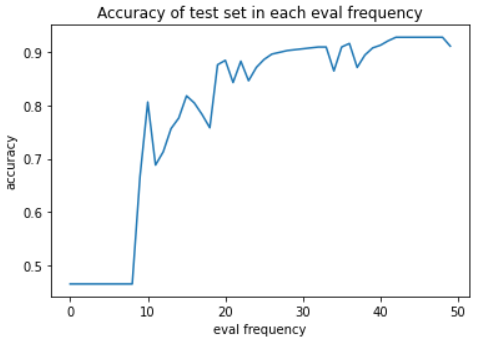 |
| implemented by pytorch | 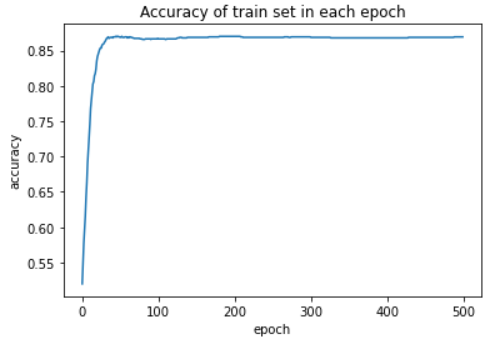 | 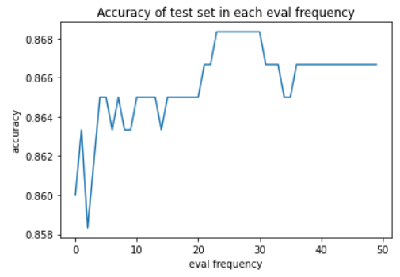 |

### 1.3 Task 3

The model and the training file are defined in

- [CIFAR10_model.py](./CIFAR10_model.py)
  - define the module
- [train_CIFAL10.py](./train_CIFAL10.py)
  - the file used to train

The architecture is defined as follow:

```python
class CIFAR10Net(nn.Module):
    def __init__(self):
        super(CIFAR10Net, self).__init__()
        self.conv1 = nn.Conv2d(in_channels=3, out_channels=32, kernel_size=(3, 3), stride=(1, 1))  # 26x26x32
        self.pool1 = nn.MaxPool2d(kernel_size=2, stride=2)  # 13x13x16
        self.conv2 = nn.Conv2d(in_channels=32, out_channels=64, kernel_size=(5, 5), stride=(1, 1))  # 9x9x64
        self.pool2 = nn.MaxPool2d(kernel_size=3, stride=3)  # 3x3x32
        self.conv3 = nn.Conv2d(in_channels=64, out_channels=128, kernel_size=(3, 3), stride=(1, 1))  # 1x1x128
        self.fc1 = nn.Linear(128, 128)
        self.fc2 = nn.Linear(128, 64)
        self.fc3 = nn.Linear(64, 10)

    def forward(self, x):
        # convolution layer
        x = self.pool1(F.relu(self.conv1(x)))
        x = self.pool2(F.relu(self.conv2(x)))
        x = F.relu(self.conv3(x))

        # flatten
        x = x.view(-1, 128)

        # full connected layer
        x = F.relu(self.fc1(x))
        x = F.relu(self.fc2(x))
        x = self.fc3(x)
        return x
```

I use some **convolution layers** and **pooling layers** to improve the module accuracy.

The accuracy is listed below

| Train Set                                                    | Test Set                                                     |
| ------------------------------------------------------------ | ------------------------------------------------------------ |
| 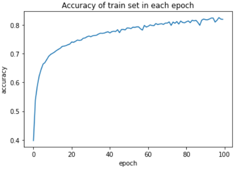 | 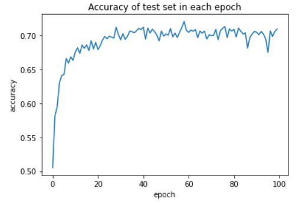 |

## 2. Part II

### 2.1 Task1

The file are listed below:

- [cnn_model.py](./cnn_model.py)
  - define the module
- [cnn_train.py](./cnn_train.py)
  - the file used to train

The architecture is defined as follow:

```python
class CNN(nn.Module):

    def __init__(self):
        super(CNN, self).__init__()
        self.conv1 = nn.Conv2d(in_channels=3, out_channels=64, kernel_size=(3, 3), stride=(1, 1), padding=1)
        self.pool1 = nn.MaxPool2d(kernel_size=(2, 2), stride=(2, 2), padding=1)
        self.conv2 = nn.Conv2d(in_channels=64, out_channels=128, kernel_size=(3, 3), stride=(1, 1), padding=1)
        self.pool2 = nn.MaxPool2d(kernel_size=(3, 3), stride=(2, 2))
        self.conv3 = nn.Conv2d(in_channels=128, out_channels=256, kernel_size=(3, 3), stride=(1, 1), padding=1)
        self.conv4 = nn.Conv2d(in_channels=256, out_channels=512, kernel_size=(3, 3), stride=(1, 1), padding=1)
        self.pool3 = nn.MaxPool2d(kernel_size=(2, 2), stride=(2, 2))
        self.fc1 = nn.Linear(4 * 4 * 512, 256)
        self.fc2 = nn.Linear(256, 64)
        self.fc3 = nn.Linear(64, 10)

    def forward(self, x):
        # convolution layer
        x = self.pool1(F.relu(self.conv1(x)))
        x = self.pool2(F.relu(self.conv2(x)))
        x = F.relu(self.conv3(x))
        x = self.pool3(F.relu(self.conv4(x)))

        # flatten
        x = x.view(-1, 4 * 4 * 512)

        # full connected layer
        x = F.relu(self.fc1(x))
        x = F.relu(self.fc2(x))
        x = F.softmax(self.fc3(x), dim=0)
        return x
```

### 2.2 Task 2

The accuracy and the loss are listed as below:

|              | Train Set                                                    | Test Set                                                     |
| ------------ | ------------------------------------------------------------ | ------------------------------------------------------------ |
| **Accuracy** | 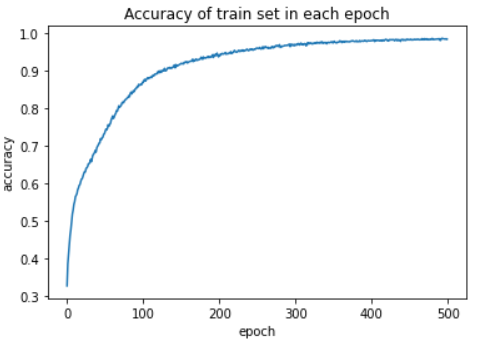 | 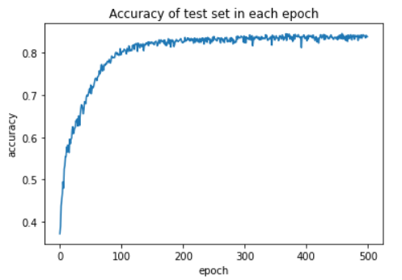 |
| **Loss**     | 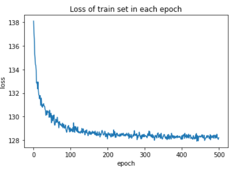 | 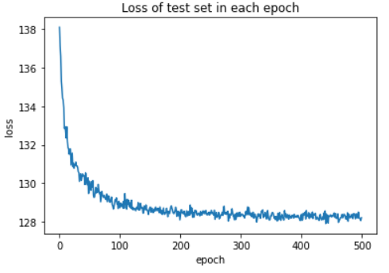 |

## 3. Part III

### 3.1 Task1

The file are listed below:

- [vanilla_rnn.py](./vanilla_rnn.py)
  - define the module
- [train.py](./train.py)
  - the file used to train

The architecture is defined as follow:

```python
class VanillaRNN(nn.Module):
    def __init__(self, seq_length, input_dim, hidden_dim, output_dim, batch_size):
        super(VanillaRNN, self).__init__()
        self.layer_num = seq_length  # 可以参考图片
        self.batch = batch_size
        self.input_dim = input_dim
        self.h = hidden_dim
        n = input_dim
        m = output_dim
        self.Wx = nn.Linear(n, self.h, bias=True)
        self.Wh = nn.Linear(self.h, self.h, bias=False)
        self.Wp = nn.Linear(self.h, m, bias=True)

    def forward(self, x):
        x_list = list()
        for t in range(self.layer_num):
            x_num = torch.zeros([self.batch, self.input_dim])
            for j in range(self.batch):
                x_num[j] = x[j][t]
            x_list.append(x_num)

        ht = torch.zeros([self.batch, self.h])
        for t in range(self.layer_num):
            ht = torch.tanh(self.Wx(x_list[t]) + self.Wh(ht))
        ot = self.Wp(ht)
        return ot

```

### 3.2 Task II

Given different $T$ (seq_length), the result are as following

- Each one trains 30 epochs

| T    | Accuracy of train set                                        | Accuracy of test set                                         |
| ---- | ------------------------------------------------------------ | ------------------------------------------------------------ |
| 3    | 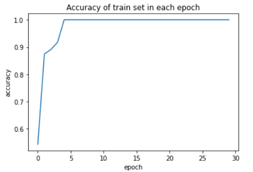 | 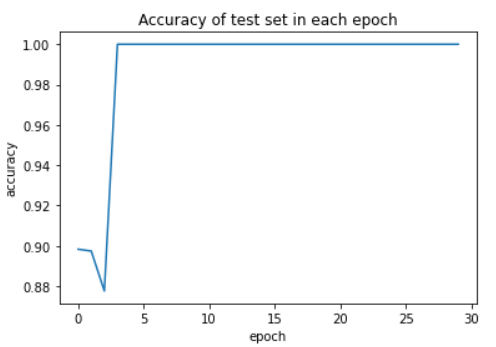 |
| 4    | 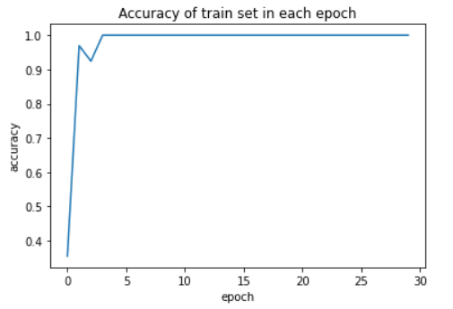 | 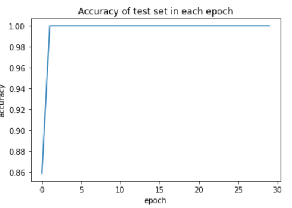 |
| 5    | 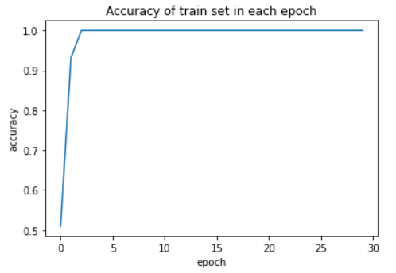 | 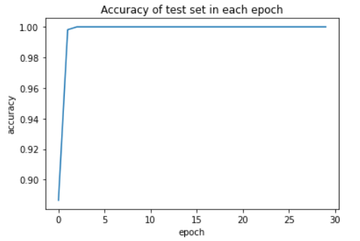 |
| 6    | 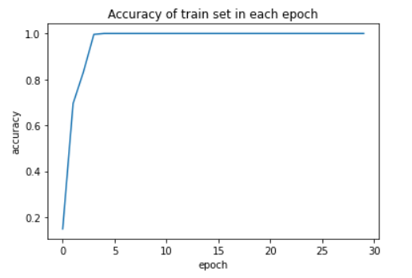 | 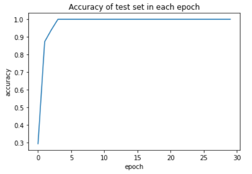 |
| 7    | 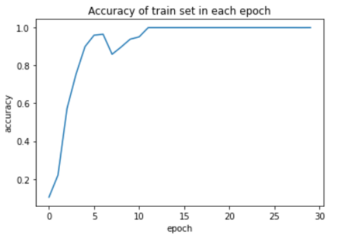 | 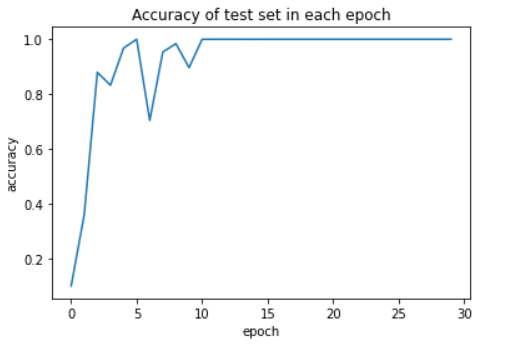 |
| 8    | 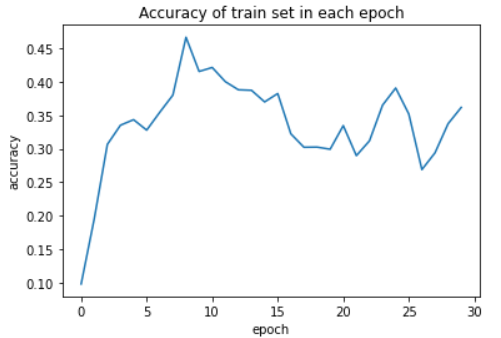 | 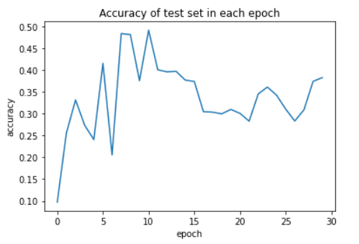 |
| 9    | 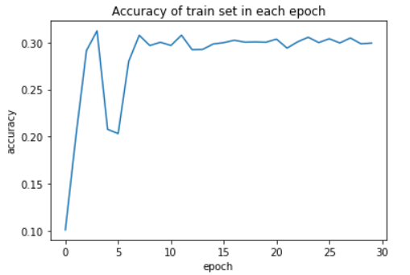 | 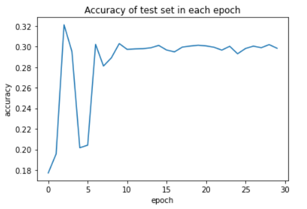 |
| 10   | 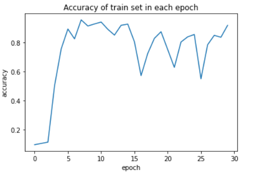 | 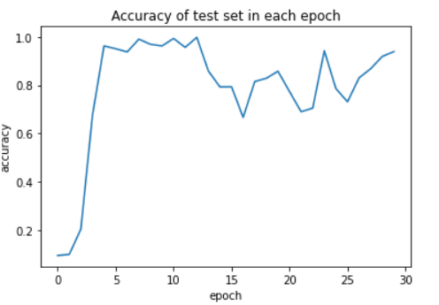 |

## 4 How to execute file(Jupyter Notebook)

### 4.1 Import files

In order to successfully execute all the file, you need to import several packages

```python
import numpy as np
import random
from scipy import stats
from sklearn.model_selection import train_test_split
import matplotlib.pyplot as plt
from pandas.core.frame import DataFrame
from sklearn import datasets
import torch
import torch.nn as nn
import torch.nn.functional as F
import torch.optim as optim
from torch.utils.data import random_split
import torchvision.transforms as transforms
import torchvision.datasets as datasets
import torchvision.models as models
```

for the self-defined files:

#### Part I

```python
import pytorch_train_mlp as PMLP # MLP implemented by pytorch
import train_mlp_numpy as MMLP # MPL implemented by myself
import train_CIFAR10 as CIFAR10CNN
```

#### Part II

```python
import cnn_train
```

#### Part III

```python
import train as rnn
```

### 4.2 Execute Code

> Please create a folder named CIFAR10data in the same folder as the jupyter notebook in order to download the dataset

#### Part I

```python
PMLP.main(n_hidden='20,12,6,5', lr=1e-2, epoch=500, eval_freq=10,
batch=30)
MMLP.main(n_hidden='20,12,6,5', lr=1e-2, epoch=500, eval_freq=10,
batch=30)
CIFAR10CNN.main(epoch=100)
```

- `n_hidden`：the architecture of hidden layers 
- `lr`：learning rate 
- `epoch`：training epoch 
- `eval_freq`：eval frequency in calculate the accuracy in the test data 
- `batch`：batch number used in mini-batch gradient descent

#### Part II

```python
cnn_train.main(lr=1e-4, eppoch=100, eval_freq=500, batch=32, optim='ADAM', data_dir='./CIFAR10data')
```

- `lr`：learning rate 
- `epoch`：training epoch 
- `eval_freq`：eval frequency in calculate the accuracy in the test data 
- `batch`：batch number used in mini-batch gradient descent
- `optim`：optimizer
- `data_dir`：the dataset directory

#### Part III

```python
rnn.main(input_length=10, num_hidden=16, batch_size=128, lr=0.02, train_steps=100, max_norm=10.0,epoch=20)
```

- `input_length`：the length of the Palindrome string
- `num_hidden`：the number of the hidden layers
- `batch_size`：batch of each training data
- `lr`：learning rate
- `train_steps`：each epoch contains how much steps
- `mar_norm`：normalization
- `epoch`：training epoch 

