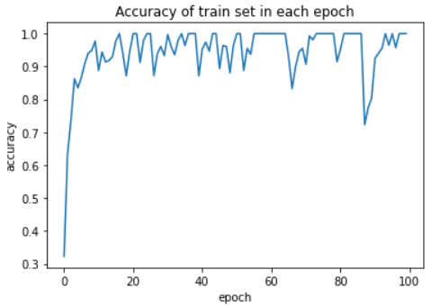
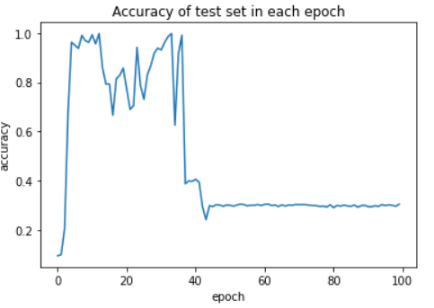
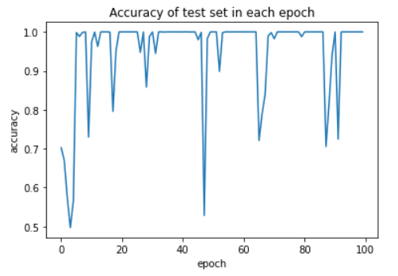
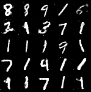
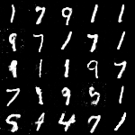
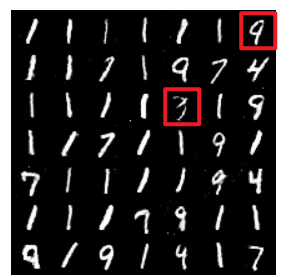
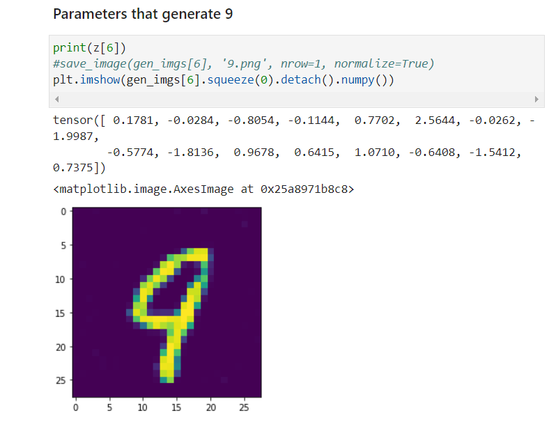
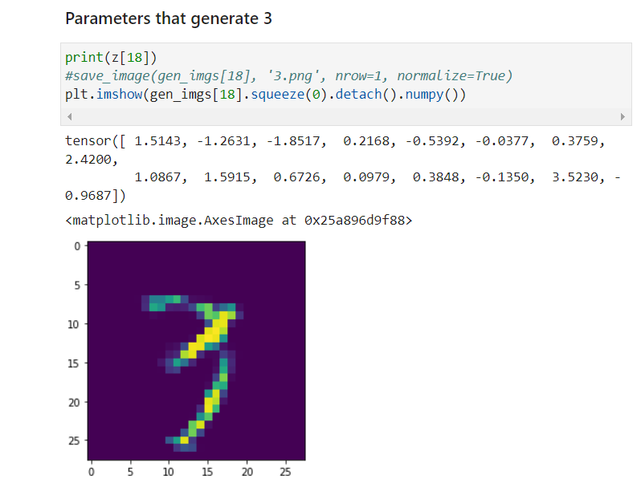
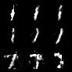

# Assignment3

> 11911839 聂雨荷

## 1. Part I

### 1.1 Task 1

I have implemented LSTM

- [lstm.py](./lstm.py)
  - define the network structure of LSTM
- [train.py](./train.py)
  - train LSTM

And the RNN in the assignment 2

- [vanilla_rnn.py](./vanilla_rnn.py)
  - define the network structure of RNN
- [train.py](./train.py)
  - the file used to train

The architecture of the LSTM is defined as follow:

```python
class LSTM(nn.Module):

    def __init__(self, seq_length, input_dim, hidden_dim, output_dim, batch_size):
        super(LSTM, self).__init__()
        # Initialization here ...
        self.layer_num = seq_length  # 可以参考图片
        self.batch = batch_size
        self.input_dim = input_dim
        self.h = hidden_dim
        n = input_dim
        m = output_dim
        self.Wgx = nn.Linear(n, self.h, bias=True)
        self.Wgh = nn.Linear(self.h, self.h, bias=False)
        self.Wix = nn.Linear(n, self.h, bias=True)
        self.Wih = nn.Linear(self.h, self.h, bias=False)
        self.Wfx = nn.Linear(n, self.h, bias=True)
        self.Wfh = nn.Linear(self.h, self.h, bias=False)
        self.Wox = nn.Linear(n, self.h, bias=True)
        self.Woh = nn.Linear(self.h, self.h, bias=False)
        self.Wp = nn.Linear(self.h, m, bias=True)

    def forward(self, x):
        # Implementation here ...
        x_list = list()
        for t in range(self.layer_num):
            x_num = torch.zeros([self.batch, self.input_dim])
            for j in range(self.batch):
                x_num[j] = x[j][t]
            x_list.append(x_num)

        ht = torch.zeros([self.batch, self.h])
        ct = torch.zeros([self.batch, self.h])
        for t in range(self.layer_num):
            gt = torch.tanh(self.Wgx(x_list[t]) + self.Wgh(ht))
            it = torch.sigmoid(self.Wix(x_list[t]) + self.Wih(ht))
            ft = torch.sigmoid(self.Wfx(x_list[t]) + self.Wfh(ht))
            ot = torch.sigmoid(self.Wox(x_list[t]) + self.Woh(ht))
            ct = gt * it + ct * ft
            ht = torch.tanh(ct) * ot
        y = self.Wp(ht)
        return y
```

### 1.2 Task 2

Given the palindrome of **length T = 10 and the epoch = 100**, the result of LSTM is much more better than RNN

|               | RNN                                                          | LSTM                                                         |
| ------------- | ------------------------------------------------------------ | ------------------------------------------------------------ |
| **Train Set** |  |  |
| **Test Set**  |  |  |

### 2.3 How to execute the code

#### Jupyter Notebook

Import the files

```python
import train as LSTM
import train_rnn as RNN
```

Use the default parameters to train the network

```python
LSTM.main()
RNN.main()
```

If you want to change the parameters, you can use the following parameters listed below

```python
LSTM.main(input_length=10, num_classes=10,
         num_hidden=16, batch_size=128, lr=0.02, train_steps=100,
         device=torch.device('cpu'), max_norm=10.0, epoch=100)
RNN.main(input_length=10, num_classes=10,
         num_hidden=16, batch_size=128, lr=0.02, train_steps=100,
         device=torch.device('cpu'), max_norm=10.0, epoch=100)
```

- `input_length`：the length of the Palindrome string
- `num_hidden`：the number of the hidden layers
- `batch_size`：batch of each training data
- `lr`：learning rate
- `train_steps`：each epoch contains how much steps
- `device`：train the network in what device
- `mar_norm`：normalization
- `epoch`：training epoch

#### Command Line

```python
python train.py --input_length 10 --input_dim 1 --num_classes 10 --num_hidden 16 --batch_size 128 --learning_rate 0.02 --train_steps 100 --device cpu --max_norm 10.0

python train_rnn.py --input_length 10 --input_dim 1 --num_classes 10 --num_hidden 16 --batch_size 128 --learning_rate 0.02 --train_steps 100 --device cpu --max_norm 10.0
```

## 2. Part II

### 2.1 Task 1

I have implemented GAN

- [my_gan.py](./my_gan.py)
  - define the network structure of GAN and the steps to train GAN
- [mnist_generator.pt](./mnist_generator.pt)
  - the weight of the GAN network I trained

The architecture of the GAN is defined as follow:

```python
class Generator(nn.Module):

    def __init__(self, latent_dim):
        super(Generator, self).__init__()
        self.fc1 = nn.Linear(latent_dim, 64)
        self.fc2 = nn.Linear(64, 256)
        self.BN2 = nn.BatchNorm1d(256)
        self.fc3 = nn.Linear(256, 512)
        self.BN3 = nn.BatchNorm1d(512)
        self.fc4 = nn.Linear(512, 784)
        self.leaky_relu1 = nn.LeakyReLU(0.2)
        self.leaky_relu2 = nn.LeakyReLU(0.2)
        self.leaky_relu3 = nn.LeakyReLU(0.2)
       

    def forward(self, z):
        # Generate images from z
        z = self.leaky_relu1(self.fc1(z))
        z = self.leaky_relu2(self.BN2(self.fc2(z)))
        z = self.leaky_relu3(self.BN3(self.fc3(z)))
        z = self.fc4(z)
        return torch.tanh(z)


class Discriminator(nn.Module):
    def __init__(self):
        super(Discriminator, self).__init__()
        self.fc1 = nn.Linear(784, 512)
        self.fc2 = nn.Linear(512, 256)
        self.fc3 = nn.Linear(256, 1)
        self.leaky_relu1 = nn.LeakyReLU(0.2)
        self.leaky_relu2 = nn.LeakyReLU(0.2)

    def forward(self, img):
        # return discriminator score for img
        img = self.leaky_relu1(self.fc1(img))
        img = self.leaky_relu2(self.fc2(img))
        img = self.fc3(img)
        return torch.sigmoid(img)
```

### 2.2 Task 2

The start of training

	

Halfway through training

	

After the training has terminated

	

### 2.3 Task 3

> For more details, please check the [Assignment3.ipynb](./Assignment3.ipynb)

By setting the random seed = 42, the first 49 generated images are as the following

	

I choose the parameters that generate 9 and the parameters that generate 3

	

	

By doing the 7 interpolation steps, the result are as follows:

	

### 2.4 How to execute the code

#### Command Line

If you want to train the GAN module I defined

```python
python my_gan.py --n_epochs 200 --batch_size 256 --lr 0.0003 --latent_dim 16 --save_interval 500
```

- After the training, it will save the weights parameters in `mnist_generator.pt`

#### Jupyter Notebook

> Please open the [Assignment3.ipynb](./Assignment3.ipynb) and execute the **0.Package Requirement** before execute the following code

Load the module

```python
import my_gan
from my_gan import Generator
G = Generator(16)
G.load_state_dict(torch.load('mnist_generator.pt'))
```

Define some methods

```python
def tensor2img(imgs_tensor, batch):
    """
        :param imgs: (batch_size, 784)
        :return: 转换成 (batch_size, 1, 28, 28)的大小
    """
    img = 0.5 * (imgs_tensor + 1)  # 将x的范围由(-1,1)伸缩到(0,1)
    img = img.view(batch, 1, 28, 28)
    return img
    
def get_interpolation_torch(start, end, steps):
    z_list = list()
    z_div = ((end-start)/(steps+2)).numpy()
    z_temp = copy.copy(start.numpy())
    z_list.append(start.numpy())
    for i in range(steps):
        z_temp += z_div
        z_list.append(copy.copy(z_temp))
    z_list.append(end.numpy())
    z_arr = np.array(z_list)
    z_torch_inter = torch.Tensor(z_arr)
    return z_torch_inter
```

Randomly choose the code z

```python
batch = 100
z = torch.randn((batch, 16))
imgs_generate = G(z)
gen_imgs = tensor2img(imgs_generate,batch)
save_image(gen_imgs[:49], 'images.png', nrow=7, normalize=True)
```

- you can check the `image.png` in the same folder after execute the code above to get the generated images

Parameters that generate 9

```python
print(z[6])
#save_image(gen_imgs[6], '9.png', nrow=1, normalize=True)
plt.imshow(gen_imgs[6].squeeze(0).detach().numpy())
```

Parameters that generate 3

```python
print(z[18])
#save_image(gen_imgs[18], '3.png', nrow=1, normalize=True)
plt.imshow(gen_imgs[18].squeeze(0).detach().numpy())
```

Get the interpolation result

```python
z_torch_inter = get_interpolation_torch(z[6], z[18], 7)
imgs_generate_inter = G(z_torch_inter)
gen_imgs_inter = tensor2img(imgs_generate_inter,9)
save_image(gen_imgs_inter[:9], 'interpolation_between_9_and_3.png', nrow=3, normalize=True)
```

- you can check the `interpolation_between_9_and_3.png` in the same folder after execute the code above to get the generated images

