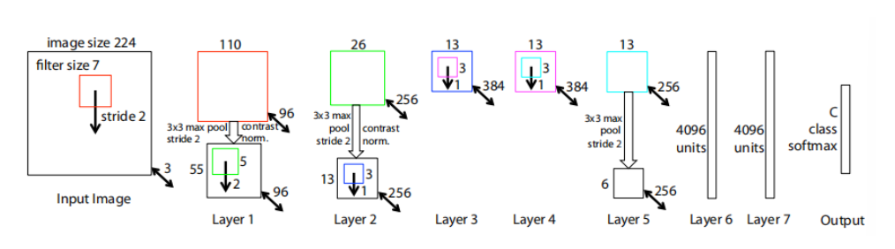
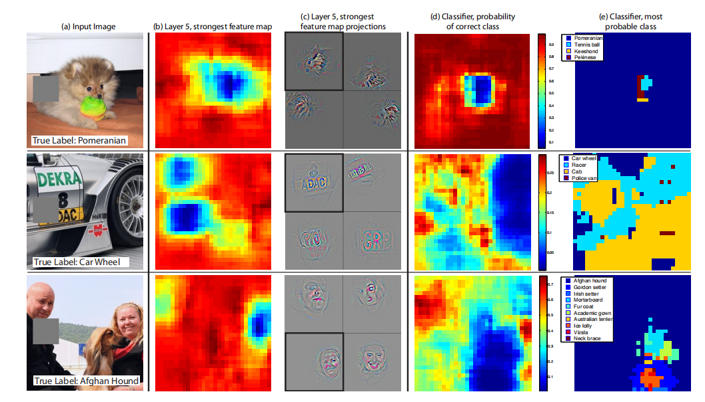
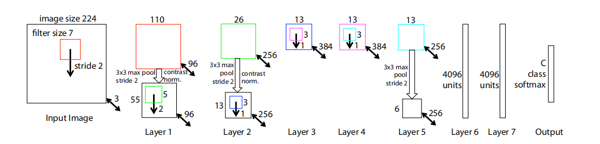
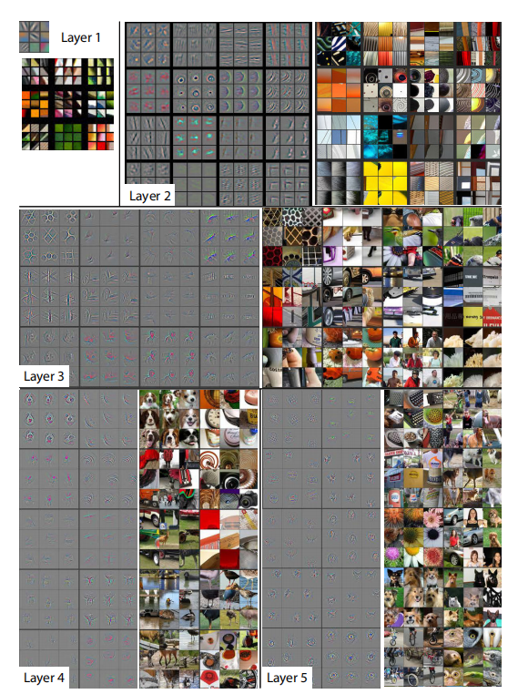
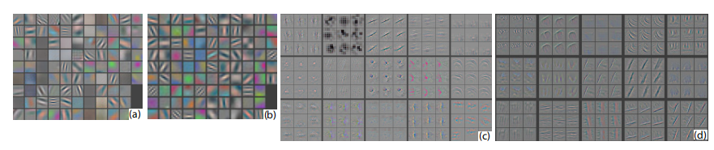
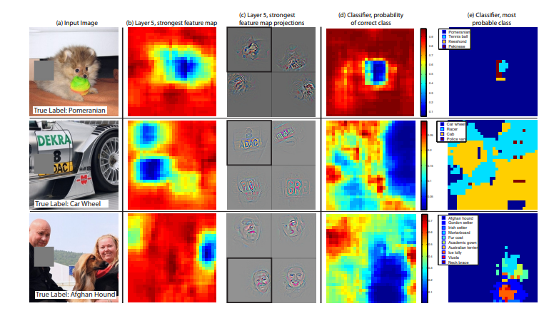

# 可视化与理解卷积神经网络

> ## 摘要
>
> 大型卷积网络模型最近在 Krizhevsky 等人的 ImageNet 基准测试中展示了令人印象深刻的分类性能。然而，对于他们为什么表现得这么好，或者如何改进他们，人们还没有明确的认识。在本文中，我们探讨了这两个问题。我们引入了一种新的可视化技术，该技术可以洞察中间特征层的功能和分类器的操作。这些可视化功能用于诊断，使我们能够找到在 ImageNet 分类基准测试中表现优于 Krizhevsky 等人的模型架构。我们还进行了消融研究，以发现不同模型层的性能贡献。我们展示了我们的 ImageNet 模型可以很好地推广到其他数据集：当重新训练 softmax 分类器时，它令人信服地击败了当前在 Caltech-101 和 Caltecb-256 数据集上的最先进的结果

## 1. 介绍

自从 LeCun 等人在 90 年代初引入它们以来，卷积网络在手写数字分类和人脸识别等任务上表现出了出色的性能。在过去的 18 个月里，有几篇论文表明，它们也可以在更具挑战性的视觉分类任务上提供出色的表现。

- Ciresan等人，在 NORB 和 CIFAR-10 数据集上展示了最先进的性能。
- 最值得注意的是，Krizhevsky 等人在 ImageNet2012 分类基准上表现出了创纪录的击败性能，他们的凸面模型可以达到错误率为 16.4%，而第二名的结果为 26.1%。
- 在这项工作之后，Girshick 等人在 PASCAL VOC 数据集上显示了领先的检测性能。

有几个因素导致了性能的显著提高

- 更大的训练集的可用性，有数百万个标记的例子
- 强大的GPU实现，使训练非常大的模型非常实用和
- 更好的模型正则化策略，如 Dropout

尽管取得了这些令人鼓舞的进展，但对于这些复杂模型的内部操作和行为，以及它们如何实现如此好的性能，人们仍然知之甚少。从科学的立场因此，这是非常不令人满意的。如果不清楚地理解它们是如何以及为什么工作的，更好的模型的开发就会被简化为试错。在本文中，我们介绍了一种可视化技术，揭示了在模型的任何层激发个体特征映射的输入刺激。它还允许我们在训练过程中观察特征的演化，并诊断模型的潜在问题。**我们提出的可视化技术使用了由 Zeiler 等人提出的多层反卷积网络**(deconvnet)，将特征激活投影回输入像素空间。我们还通过遮挡输入图像的部分，对分类器输出进行灵敏度分析，揭示场景的哪些部分对分类是重要的。

使用这些工具，我们从 Krizhevsky 等人的架构开始，探索不同的架构，发现那些在 ImageNet上表现更好的架构。然后我们探索模型对其他数据集的泛化能力，只是在上面重新训练 softmax 分类器。因此，这是一种有监督的预训练形式，这与 Hinton 等人等人推广的无监督的预训练方法形成了对比[1,26]。

### 1.1 相关工作

#### 可视化

可视化特征以获得对网络的直觉是一种常见的做法，但大多局限于第一层，其中对像素空间的投影是可能的。在更高的层次中，必须采用替代方法，通过在图像空间中进行梯度下降来寻找每个单元的最优刺激，使单元的激活最大化。这需要一个仔细的初始化，并且不提供任何信息关于单位的不变性的信息。由于后者的不足，[19]（扩展了[2]的想法）展示了如何围绕最优方法数值计算给定单元的黑森他给不变性提供了一些见解。问题是，对于更高的层，不变性是非常复杂的，所以不能被一个简单的二次近似捕获。我们的方法，按续Rast，提供了一个不变性的非参数视图，显示了来自训练集中的哪些模式激活了特征映射。我们的方法类似于当代西蒙尼等人的[23]演示说明如何通过从网络的全连接层投射回，而不是我们使用的卷积特征，从凸网中获得显著性映射。吉尔希克等人的[10]秀识别数据集中那些在模型中更高层次上负责强激活的补丁的可视化。我们的可视化不同之处在于它们不仅仅是输入ima的作物而是自上而下的投影，揭示了每个补丁内的结构，刺激了一个特定的特征地图。

#### 特征泛化

我们对卷积网络特征的泛化能力的证明也在 Donahue 等人的并行工作中进行了探索。在前一种情况下，他们使用卷积网络特性在 Caltech-101 和 Sun 场景数据集上获得最先进的性能，在后者中，他们使用 PASCAL VOC 数据集上的对象检测。

## 2. 方法

我们在整个论文中使用由 LeCun 等人和 Krizhevsky 等人定义的**完全监督卷积网络模型**。这些模型将一个彩色2D输入图像 $x_i$，通过一系列的神经网络层，映射到一个有 $C$ 个不同的类的概率向量 $\hat{y_i}$ 上。每一层包含了

1. 前一层输出的卷积与一组学习过的滤波器（或者，在第一层的情况下，是输入的图片）
2. 通过一个修正的线性函数来传递响应（$relu(x) = max(x,0)$）
3. [可选的] 局部邻居的最大池化层
4. [可选的] 一个局部对比操作，标准化响应跨特征映射

网络的最上面几层是传统的全连接网络，**最后一层是 softmax 分类器**。下图显示了我们多次实验中使用的模型：

我们使用了一个很大的数据集，它是有 $N$ 个标签的数据集 $ \{ x,y\}$，其中，标签 $y_i$ 是一个离散的变量，它标示着真正的划分类别。我们采用适用于图像分类的**交叉熵损失函数**来比较 $\hat{y_i}$ 和 $y_i$。网络的参数（卷积层中的滤波器，全连接层中的权值矩阵和偏差）是通过反向传播损失的导数来训练的更新整个网络的参数，并通过**随机梯度下降**来更新参数。更多的细节可以看第三部分。

### 2.1 使用 Deconvnet 进行可视化

理解卷积神经网络的操作需要解释中间层中的特征活动。我们提出了一种新的方法来**将这些活动映射到输入像素空间**，显示了最初导致特征映射中给定激活的输入模式。我们使用反卷积网络来执行这个映射。Deconvnet 可以被认为是一个卷积神经网络模型，它使用相同的组件（滤波器，池化），但是是反着的，所以与其将像素映射到特征，则相反。在 Zeiler 等人的描述中，反卷积神经网络被提出作为一种执行**无监督学习的方法**。在这里，它们不用于任何学习能力，只是作为一个已经训练的卷积神经网络。

为了检查卷积网络，在每一层上附加一个反卷积网络，如下图所示，提供一个返回到图像像素的连续路径。

- 顶部：反卷积网络层（左）连接到卷积网络层（右）。反卷积网将重建一个与卷积网络层底部的估计版本。
- 底部：说明在反卷积网络层中的反池化操作，使用 switch 记录池化过程中每个池化区域（彩色区域）的局部最大的位置。黑/白颜色的方块是负/正激活

首先，将一个输入图像呈现给卷积网络，并计算整个层的**特征**。为了检查给定的卷积网络激活，我们将该层中的所有其他激活设置为 0，并将**特征映射作为输入**传递给附加的反卷积网络层。然后，我们成功完成了下面的事情

- 反池化 Unpooling
- 纠正 Rectifification
- 过滤 Filtering

来重建产生所选激活的下层活动。然后重复这个过程，直到到达输入像素空间

---

#### 反池化 Unpooling

在卷积网络中，**最大池化操作是不可逆的**，无论我们如何通过记录在一组 switch 变量中每个池化区域的最大值的位置来获得一个近似的逆。在反卷积网络中，反池化操作使用这些 switch 将来自上一层的重建数据放置到合适的位置，同时保留刺激的结构。

#### 纠正 Rectification

卷积神经网络使用 ReLU 非线性校正特征映射，从而确保特征映射总是正的。为了在每一层获得有效的特征重构（也应该是正的），我们通过一个relu非线性来传递重构信号

#### 过滤 Filtering

卷积神经网络使用学习过的滤波器对来自前一层的特征图进行卷积。为了近似地反转这一点，反卷积神经网络使用相同滤波器的转置版本（与其他自动编码器模型，如 RVM），但应用于**纠正后的映射**，而不是下面层的输出。实际上，这意味着垂直和水平地翻转每个滤波器。

---

注意，在这个重构路径中，**我们不使用任何强制归一化操作**。从更高的层投射下来，使用最大池在卷积神经网络的想向上的产生的 switch 设置。由于这些 switch 设置对于给定的输入图像是特殊的，因此从单个激活中获得的重构类似于原始输入图像的一小部分，根据其对特征激活的贡献对结构进行加权。由于模型是有区别地训练的，它们隐式地显示输入图像的哪些部分是有区别的。注意，这些投影不是来自模型的样本，因为没有涉及生成过程。整个过程类似于反向传播一个单一的强激活(而不是通常的梯度)，例如，计算 $\frac{dh}{dX_n}$，其中 $h$ 是强激活的特征映射的元素， $X_n$ 是输入图片。然而，也有如下的差异

- ReLU 是独立施加的
- 没有使用强制归一化操作

我们的方法的一个普遍的缺点是，**它只可视化单个激活**，而不是出现在一个层中的关节活动。然而，在下图中，,这些可视化是准确表征输入模式的刺激给定的特征映射模型，当部分原始输入图像的对应模式被遮挡，我们看到一个不同的活动在下降特性映射。

## 3. 训练细节

现在我们描述将在第 4 节中可视化的大型卷积网络模型。它的架构，如下图所示，与 Krizhevsky 等人使用的是相似的用于 ImageNet 的分类。**一个不同之处在于 Krizhevsky 的3、4、5层中使用的稀疏连接（由于模型被拆分为 2 个GPU）被替换成了紧密连接**，与第 1 层和第 2 层相关的其他重要差异是在后面是的可视化检查之后做出的，如 4.1 节所述。

该模型是在ImageNet 2012训练集(130万张图像，分布在1000多个不同的类)[6]上训练的。每个RGB图像经过预处理，将最小的尺寸调整为256，裁剪中心256x256区域，减去每像素平均(所有图像)，然后使用大小为224x224的10个不同的子作物(角+中心，水平翻转)。使用128个小批量的随机梯度下降来更新参数，学习速率为 $10^{-2}$，动量项为 0*.*9。当验证误差趋于稳定时，我们在整个人工训练过程中退火了学习速率。Dropout在全连接层(6和7)中使用，速率为0.5。所有权重初始化为 $10^{−2}$，偏差设置为0。

在训练期间对第一层滤镜的可视化显示，其中一些滤镜占主导地位。为了解决这个问题，我们对卷积层中的每个滤波器进行重正规化，使其RMS值超过 $10^{-1}$ 的固定半径。这是至关重要的，特别是在模型的第一层，其中输入的图像大致在 [-128,128] 范围内。与 Krizhevsky 等人一样，我们为每个训练示例生成多种不同的作物和翻转，以增加训练集的大小。在70个epoch之后，我们停止了训练，使用基于的实现在单个GTX580 GPU上花费了大约 12 天的时间。

## 4. 反卷积网络可视化

使用第 3 节中描述的模型，我们现在反卷积网络来可视化 ImageNet 验证集上的特性激活。

**特征可视化**：下图显示了训练完成后我们的模型的特征可视化。对于给定的特征映射，我们展示了前 9 个激活，每个激活分别投射到像素空间，揭示了激活该映射的不同结构，并显示了它对输入变形的不变性。在这些可视化的旁边，我们展示了相应的图像补丁。这些比可视化有更大的变化，而可视化只关注每个补丁中的区别结构。例如，在第5层，第1行，第2列，图片似乎没有什么共同之处，但可视化显示，这个特殊的特征地图集中在背景中的草，而不是前景对象。

每一层的投影显示了网络中特征的分层性质。第 2 层回应角落和其他边缘/颜色结合。图层3有更复杂的不变性，捕捉相似的纹理(例如，网格模式(行1,Col 1);文本(R2、C4))。第 4 层显示出显著的变化，并且更具有阶级特异性:狗的脸(R1,C1);鸟的腿(R4,C2)。第 5 层显示了具有显著姿势变化的整个物体，如键盘(R1,C11)和狗(R4)。

	

**训练期间的特征演变**：下显示了在投射回像素空间的给定特征映射中，最强激活的训练过程(在所有训练示例中)。外观的突然跳跃源于图像的变化，而最强烈的激活源于图像的变化。模型的下层可以看到在几个 epoch 内收敛。然而，上层只有在相当数量的 epoch(40-50)之后才发展，这表明需要让模型一直训练到完全收敛。

### 4.1 体系架构选择

虽然经过训练的模型的可视化提供了对其操作的洞察，但它也可以帮助首先选择好的架构。通过可视化Krizhevsky 等人的第一和第二层架构(图(a) &amp;(c)，各种问题是明显的。第一层滤波器是极高频和低频信息的混合，几乎不覆盖中频。此外，第 2 层可视化显示了由第 1 层卷积中使用的大跨度4引起的混叠效应。为了解决这些问题，我们

- (i)将第一层过滤器的尺寸从11x11减少到7x7，
- (ii)将卷积的范围从4步扩大到2步。

这种新的架构在第一层和第二层特性中保留了更多的信息，如图(b) &amp;(d).更重要的是，它还改善了第 5.1节所示的分类性能。

### 4.2 遮蔽敏感性

对于图像分类方法，一个很自然的问题是，模型是否真的识别出了图像中物体的位置，还是仅仅使用了周围的上下文。下图试图通过系统地用一个灰色正方形遮挡输入图像的不同部分来回答这个问题，并监测分类器的输出。这个例子清楚地表明，模型正在场景中定位对象，因为当对象被遮挡时，正确类的概率显著下降。下图还显示了顶层卷积层最强的特征图的可视化，以及该图中的活动(空间位置的总和)作为遮挡器位置的函数。

 当遮盖器覆盖在可视化中出现的图像区域时，我们会看到特征图中活动的强烈下降。这表明可视化确实对应于刺激该特征映射的图像结构，因此验证了其它图中的可视化

## 5. 实验

### 5.1 ImageNet 2012

该数据集包含1.3M/50k/100k训练/验证/测试样例，分布在1000多个类别。表中显示了我们在该数据集上的结果。

	

使用Krizhevsky等人在中指定的确切架构，我们尝试在验证集中复制它们的结果。在ImageNet 2012验证集上，我们获得了他们报告值的0.1%以内的错误率。

接下来，我们分析在第4.1节中概述的架构变化下我们模型的性能(层1中的7个滤波器和层1中的stride 2卷积&amp;2).如图3所示，该模型显著优于Krizhevsky等人[18]的体系结构，比他们的单模型结果高出1.7% (test top-5)。当我们合并多个模型时，我们得到了14.8%的测试误差，提高了1.6%。这个结果与Howard[15]的数据增强方法所产生的结果很接近，可以很容易地与我们的架构相结合。然而，我们的模型离2013年Imagenet分类比赛[28]的冠军还有一段距离。

**不同的ImageNet模型尺寸：**在下表中，我们首先通过调整层的大小或完全删除它们来探索Krizhevsky et al.[18]的架构。在每种情况下，模型都是用修改后的体系结构从头开始训练的。删除完全连接的层(6,7)只会略微增加错误(在下面，我们参考前5个验证错误)。这是令人惊讶的，因为它们包含了大多数模型参数。去掉中间两个卷积层对错误率的影响也相对较小。然而，去掉中间卷积层和完全连通层后，得到的模型只有4层，其性能显著下降。这表明，模型的整体深度对于获得良好的性能非常重要。然后我们修改我们的模型，如图3所示。改变全连通层的大小对性能影响不大(Krizhevsky et al.[18]的模型也是如此)。然而，增加中间卷积层的大小可以在性能上获得有用的增益。但是增加这些，同时也扩大了完全连接的层会导致过度拟合。

	

### 5.2 特征泛化

上面的实验表明了我们ImageNet模型中卷积部分在获得最先进的性能方面的重要性。这得到了图2的可视化支持，图2显示了在卷积层中学习到的复杂不变性。我们现在研究这些特征提取层推广到其他数据集的能力，即Caltech-101 [9]， Caltech-256[11]和PASCAL VOC 2012。为此，我们将imagenet训练过的模型的第1-7层保持固定，并使用新数据集的训练图像在最上面训练一个新的softmax分类器(用于适当数量的类)。由于softmax包含相对较少的参数，因此可以从相对较少的示例中快速训练它，对于某些数据集也是如此。

实验将我们从ImageNet获得的特征表示与其他方法手工制作的特征进行了比较。在我们的方法和现有的方法中，Caltech/PASCAL训练数据只用于训练分类器。由于它们具有相似的复杂性(我们的是softmax，其他人是线性SVM)，因此特征表示对性能至关重要。需要注意的是，这两种表示都是使用超出Caltech和PASCAL训练集的图像构建的。例如，在行人数据集[5]上通过系统实验确定HOG描述符中的超参数。

我们还尝试了第二种从零开始训练模型的策略，即在PASCAL/Caltech数据集的训练图像上，将1-7层重置为随机值并训练它们以及softmax。

一个复杂的问题是，一些Caltech数据集的一些图像也在ImageNet训练数据中。使用归一化相关，我们识别出这些少数“重叠”的图像2，并将它们从Imagenet训练集中去除，然后重新训练我们的Imagenet模型，从而避免了训练/测试污染的可能性。

**Caltech-101**：我们遵循[9]的过程，每类随机选择15或30幅图像进行训练和测试，每类最多50幅图像报告表3中每类精度的平均值，使用5个训练/测试折叠。30张图片/课程花了17分钟。预训练的模型比[3]报告的30张图片/类的最佳结果高出2.2%。我们的结果与Donahue et al.[7]最近发表的结果一致，他们获得了86.1%的准确率(30 imgs/class)。然而，从头开始训练的卷积神经网络模型表现很糟糕，仅达到46.5%，这表明在如此小的数据集上训练一个大型卷积神经网络是不可能的。

**Caltech-256**：我们按照[11]的步骤，为每个类选择15、30、45或60个训练图像，在表4中报告每个类的精度的平均值。我们的imagenet预训练模型比Bo et al.[3]等人目前获得的最先进的结果有显著的优势:对于60张训练图像/类，为74.2% vs 55.2%。然而，与加州理工101一样，从零开始训练的模型表现不佳。在图7中，我们探索了一次性学习的[9]机制。在我们的预训练模型中，只需要6张加州理工学院的256张训练图像，就可以打败使用10倍图像的领先方法。这显示了ImageNet特征提取器的强大功能。

**PASCAL 2012**：我们使用标准的训练和验证图像，在imagenet预处理卷积网络上训练一个20路softmax。这并不理想，因为PASCAL图像可以包含多个对象，而我们的模型只是为每个图像提供一个唯一的预测。表5显示了测试集上的结果，对比了领先的方法:竞争中排名前2的条目和Oquab et al.[21]的并发工作，他们使用了具有更合适分类器的convnet。PASCAL和ImageNet图像在本质上有很大的不同，前者是完整的场景，而后者不同。这也许可以解释为什么我们的平均成绩比领先的比赛结果[27]低3.2%，但我们确实在5个级别上击败了他们，有时还远远超过他们。

### 5.3 特征分析

我们将探索imagenetpretraining模型的每一层特征的区别性。我们通过改变ImageNet模型保留的层数，并在上面放置线性SVM或softmax分类器来实现这一点。表6显示了Caltech-101和Caltech-256的结果。对于这两个数据集，我们可以看到一个稳定的改进，因为我们提升模型，与最佳的结果是通过使用所有层。这支持了一个前提，即随着特性层次的加深，它们会学习到越来越强大的特性。

## 6. 讨论

我们探索了多种大型卷积神经网络模型，进行图像分类训练。首先，我们提出了一种在模型内可视化活动的新方法。这揭示了特征远非随机的，不可解释的模式。相反，它们显示了许多直观上理想的属性，如组合性，增加的不变性和阶级歧视，随着我们的提升层。我们还展示了如何使用这些可视化来识别模型的问题，从而获得更好的结果，例如改进 Krizhevsky 等人的[18]令人印象深刻的 ImageNet2012 年结果。然后，我们通过一系列的遮挡实验证明，该模型在训练分类时，对图像中的局部结构高度敏感，而不仅仅是使用宽场景背景。对该模型的消融研究表明，对网络的最小深度，而不是任何单个的部分，对模型的性能至关重要。

最后，我们展示了 ImageNet 训练的模型如何能很好地泛化到其他数据集。对于Caltech-101和Caltech-256，数据集非常相似，以至于我们可以超过报告的最好结果，在后者的情况下有显著的差距。我们的convnet模型对PASCAL数据的推广效果较差，可能存在数据集偏差，但仍在 3 以内。最佳报告结果的2%，尽管没有针对任务进行调优。例如，如果使用不同的损失函数，允许每张图像有多个对象，我们的性能可能会提高。这自然也会使网络能够处理对象检测。

