# Lecture2 Wang Tiles

> http://cr31.co.uk/stagecast/wang/intro.html

## 1. Introduction

Wang tiles were first proposed by mathematician, Hao Wang in 1961. 

A set of **square** tiles, with each **tile edge of a fixed color**, are arranged side by side in a **rectangular grid**. All four edges of each tile must '**match**' (have the **same color** as) their adjoining neighbor.

The tiles never overlap and usually all spaces (cells) in the grid are filled. Tiles have a 'fixed orientation', they are never rotated or reflected (turned over).

With careful tile design, a complete array can produce a large image without visual 'breaks' between tiles. This helps computer game designers create **large tiled backgrounds from a small set of tile images**.

### Wang Tileset

Here is a set of Wang tiles. You can see that every tile has two different types of edge; blue or yellow. This gives $2×2×2×2$ (written as $2^4$), or $16$ possible combinations.

Hence the complete set contains $16$ different tiles.

The set is said to be `complete` as it includes a tile for every possible combination of two edges. We can use these tiles to fill a grid where all tile edges match.

We arrange Wang tiles in a grid array. For each position, a tile is selected at random from the tileset, always ensuring that all edges match adjacent tiles.

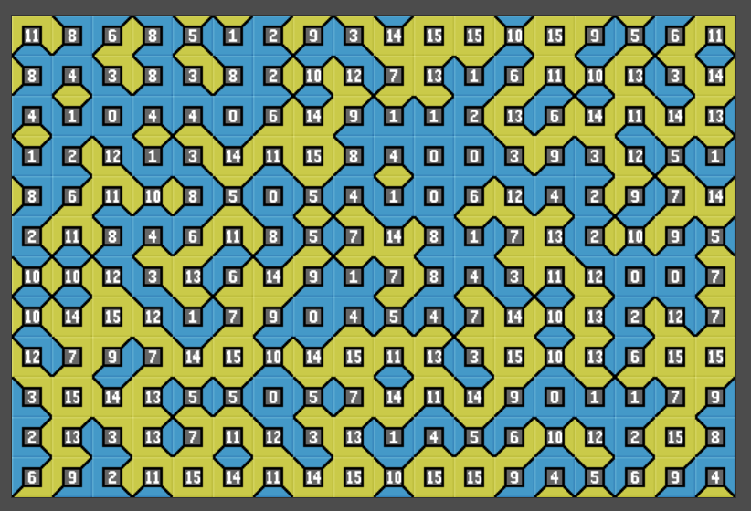

## 2. Wang Tile Types

### 2-edge tiles

Every tile grid has two different types of edge.

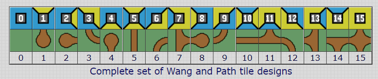

#### Variations

Here is the original tileset (top row) along with a few path design variations.

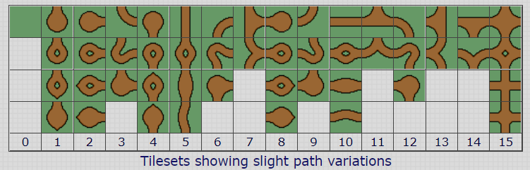

- Tile-0 has no variations.

Here is a couple of pipe design variations of the tileset.

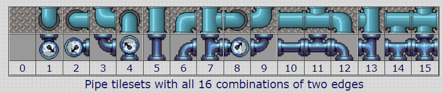

### 2-corner tiles

Wang tilesets are usually edge tilesets. But we can also create a Wang tileset by considering the tile corners.

Each tile has four corners so for $2$ different types of corner we have $2^4$ or $16$ different tiles, the same number as $2$ different edges.

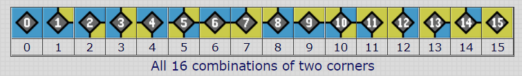

It may seem that matching corners will produce similar results as matching edges, but this is not so. An edge only affects one adjacent tile, while matching a corner affects three adjacent tiles.

#### Variations

Here is a path tileset which as you can see is very similar to the 2-edge path tileset, which is shown here for comparison. The corner tileset appears rotated by 45°. A few different tile variations are also shown.

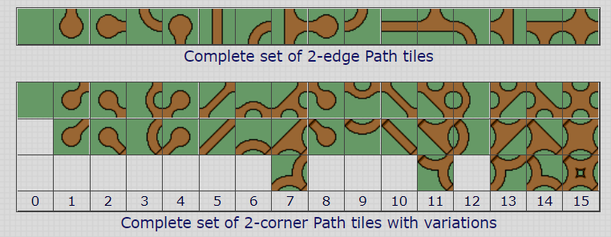

#### Terrain Tileset

Wang corner tiles make good terrain tiles. You can see that every tile has two different types of corner.

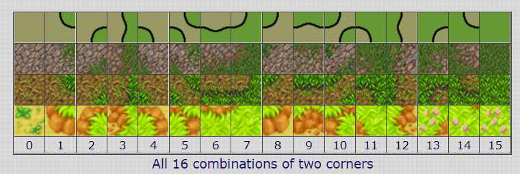

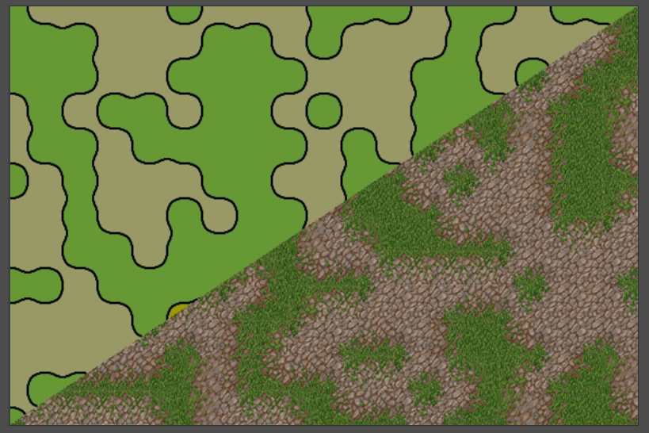

### 3-corner tiles

The complete set contains $3^4=81$ tiles, colored blue, yellow and green. (This can be thought of as increasing height of water, sand and grass terrain). The outer edge of each tile is marked, but not the boundary between similar colors on the same tile.

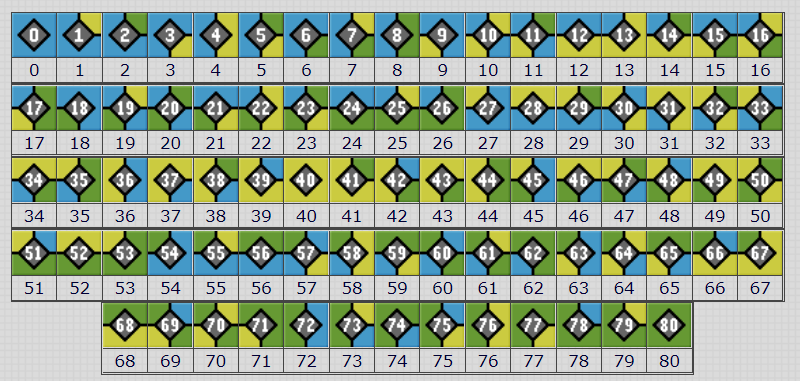

#### Tile Rotation Symmetry

By removing self similar rotations, we reduce the 3-corner Wang tileset to 24 tiles. Wang tiles are never rotated but this is a compact way of showing the complete tileset.

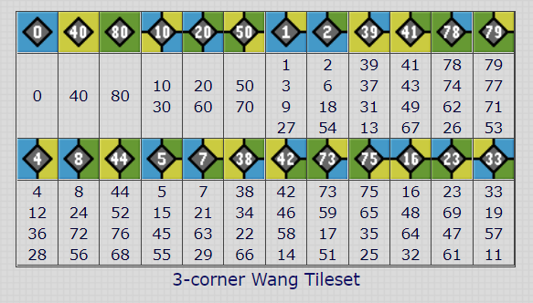

#### Variations

From the above Wang tiles, a simple design can be constructed where each Wang tile corner color determines a different height of terrain.
Blue - middle/ground, Yellow - high level and Green - low level.

### 1-side edge tiles

Here is a complete 2-edge Wang tileset.

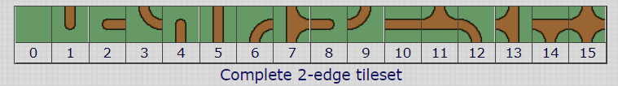

By adding unconnected dead-end paths to all empty edges with no path, we create a set of 1-side tiles where all sides are the same.

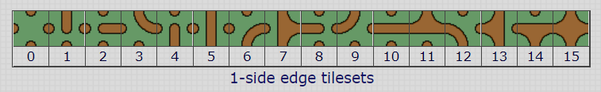

## 3. Property

